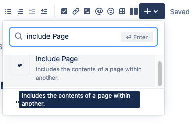

# Expo builds to Confluence

### Publish Expo builds to Confluence Cloud

Publish [Expo builds](https://expo.dev) to a dedicated [Atlassian Confluence Cloud page](https://support.atlassian.com/confluence-cloud/docs/create-edit-and-publish-a-page/) using an [EAS webhook alert](https://docs.expo.dev/eas/webhooks/).

Updates the page by inserting the build infos and a QRCode for each build environment (e.g.: continuous, staging, production) and platform (android, iOS) to the proper section of the page.

#### Example of the generated page

  
Example

  

#### Endpoints
- `GET /healthcheck` Valid if service is up
- `POST /init` Updates the whole Confluence page with a default layout. The default layout is needed to be able to insert new build from `/webhook`
- `POST /webhook` Send a Expo build payload to be added to Confluence

#### Environment variables
- **PORT**: the host exposed port for this webservice to listen on, defaults on `8080`
- **EXPO_HMAC_SECRET**: 16 chars secret required by eas webhook, should be set in your secrets in your expo.dev app, e.g.: https://expo.dev/accounts/NAME/projects/PROJECT/secrets
- **CONFLUENCE_CLOUD_DOMAIN**: confluence cloud domain, e.g.: https://DOMAIN.atlassian.net/
- **CONFLUENCE_TOKEN**: your atlassian account token, e.g.: https://id.atlassian.com/manage-profile/security/api-tokens
- **CONFLUENCE_USER**: your atlassian email account
- **CONFLUENCE_SPACE**: your cofluence workspace, see URL `/wiki/spaces/SPACE/`, e.g.: BLOG
- **CONFLUENCE_PAGE_ID**: the atlassian confluence page id used to update, e.g.: https://DOMAIN.atlassian.net/wiki/spaces/SPACE/pages/PAGEID

#### Test the webservice
Use [Postman](https://www.postman.com/downloads/) and open the `endpoints.postman_collection.json` file to test the endpoints locally or in production. See the `pre-script` section of every request to set your environment variables, eventually you can set those in your global environment vars in Postman.

#### Embed the generated page into another page

It's possible to embed this template page into another confluence page, using the "Include Page" macro.

